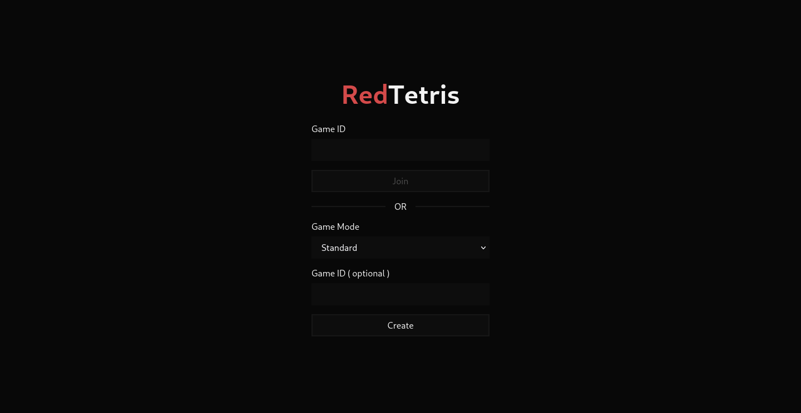
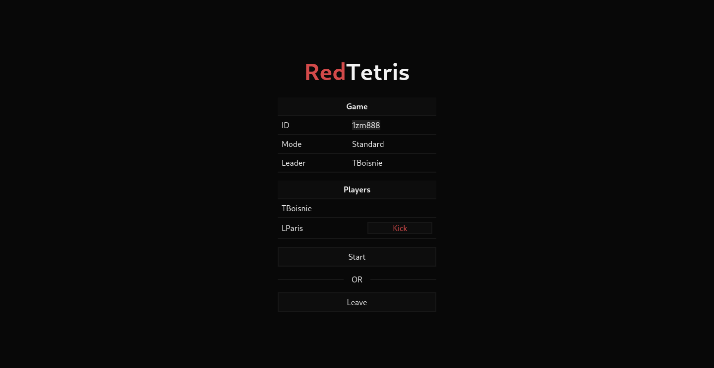
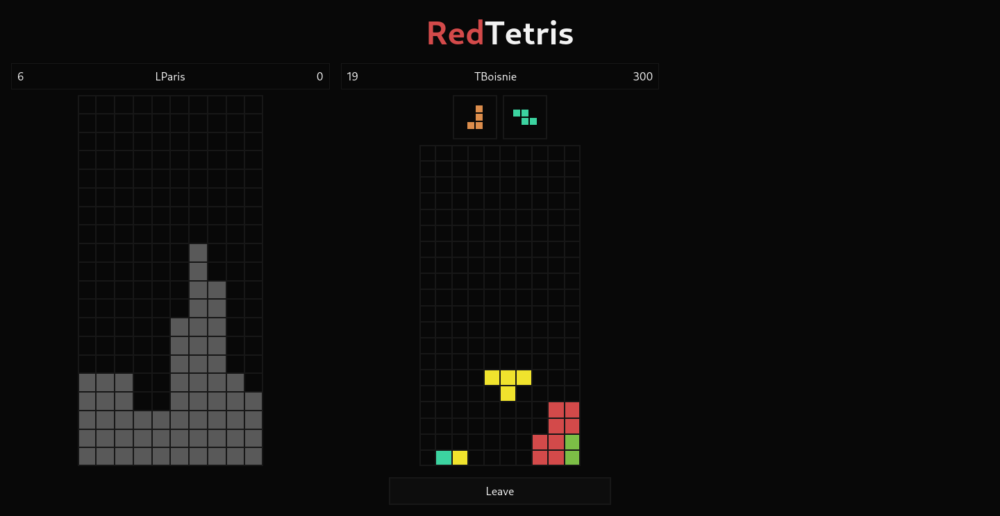
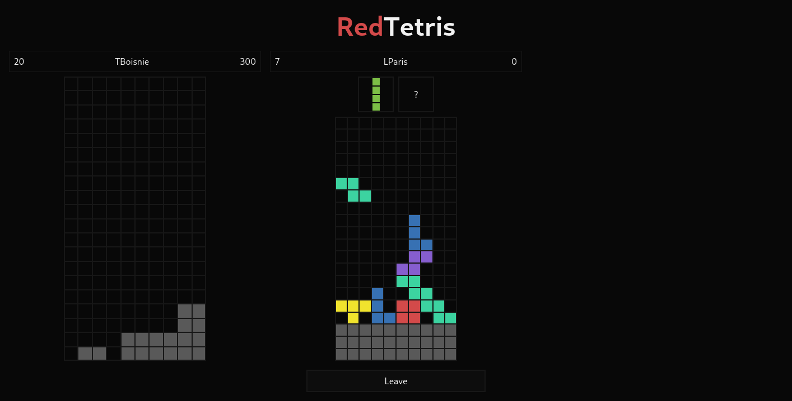
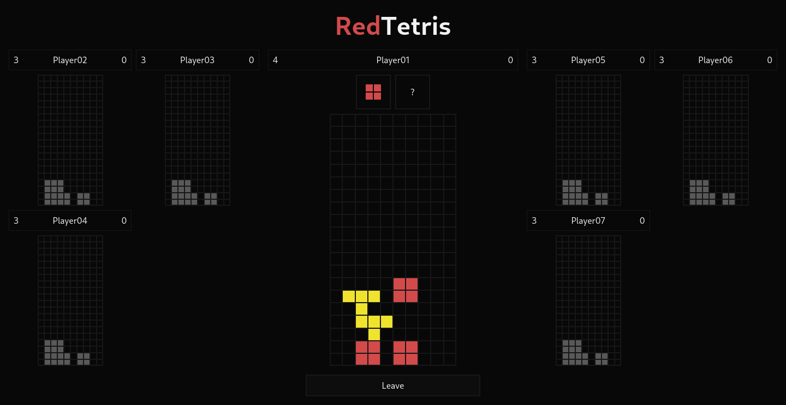
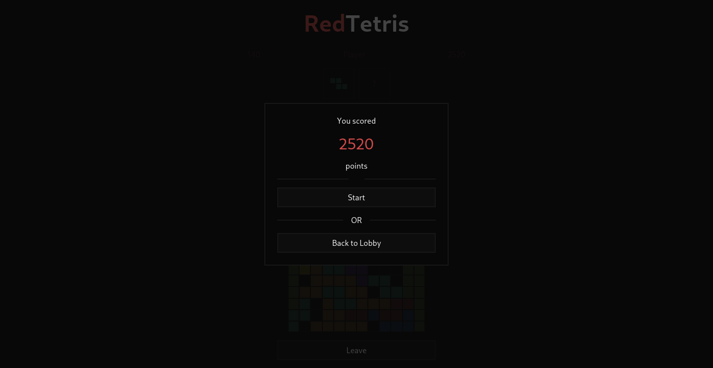

# 42 - Web - Red Tetris

Creation of a website using `React`, `Redux`, `ExpressJS`, `Socket.io` and `Jest` for Unit Tests.

Features :
- Tetris Game : Different game modes (easy, standard, expert), Score (points), Hold (store a Tetromino), Penalities (in multiplayer)
- Tetris Rooms : Solo or Multiplayer (up to 9 players, game-id to be able to send invitation)
- Tetris Management : Owner (decide when to start the game), Join (cannot join a started game)

Controls :
- Q, Arrow left : Move left
- D, Arrow right : Move right
- S, Arrow down : Move down
- W, Arrow up : Rotate (clockwise)
- Space : Fall down

## Requirements

- [NodeJS](https://nodejs.org/en)
- [PNPM](https://pnpm.io/) _(Optional: `npm`, `yarn` should work too)_

## Getting Started

1. Install dependencies

	```sh
	# Change directory
	cd ./srcs

	# Install
	cd ./client && pnpm install ; cd -
	cd ./server && pnpm install ; cd -
	```

1. Build

	```sh
	# Run
	cd ./client && pnpm run build ; cd -
	```

1. Test

	```sh
	# Test
	cd ./client && pnpm run test:coverage:all
	cd ./server && pnpm run test:coverage --watchAll
	```

1. Execute

	```sh
	# Run
	cd ./server && pnpm run start
	```

1. Access : __http://localhost:8080__

## Screenshots









## Authors

- [BOISNIER Thomas](https://github.com/TBoisnie/) _(Client)_
- [PARIS Lilian](https://github.com/lparis42/) _(Server)_
