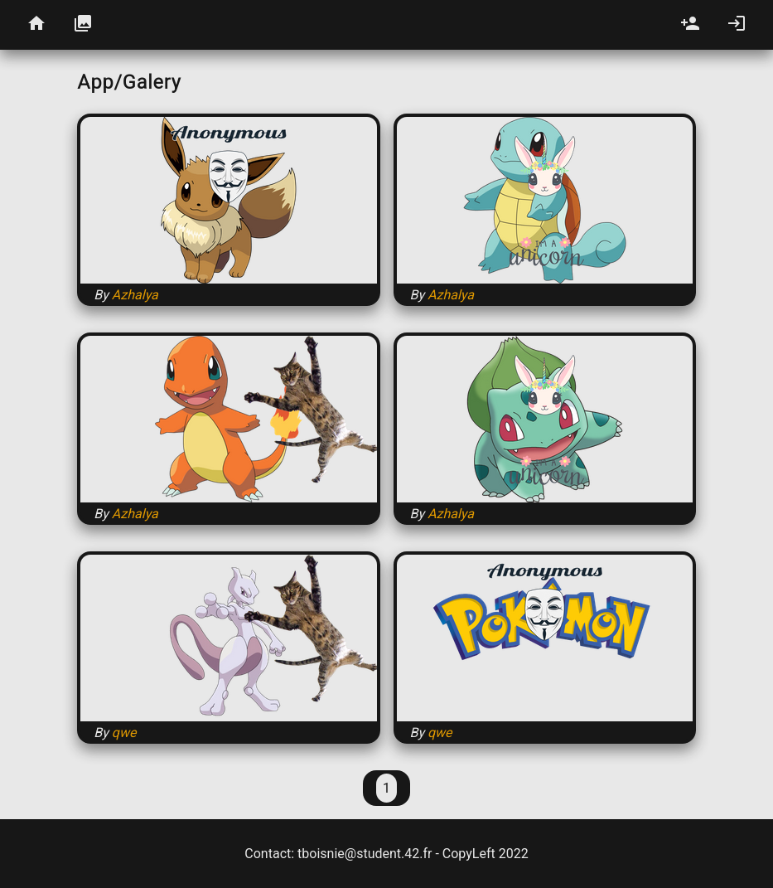
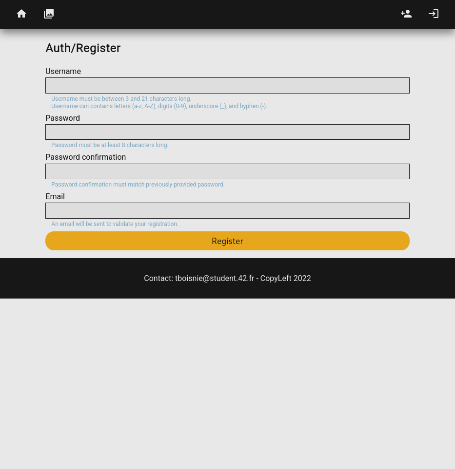
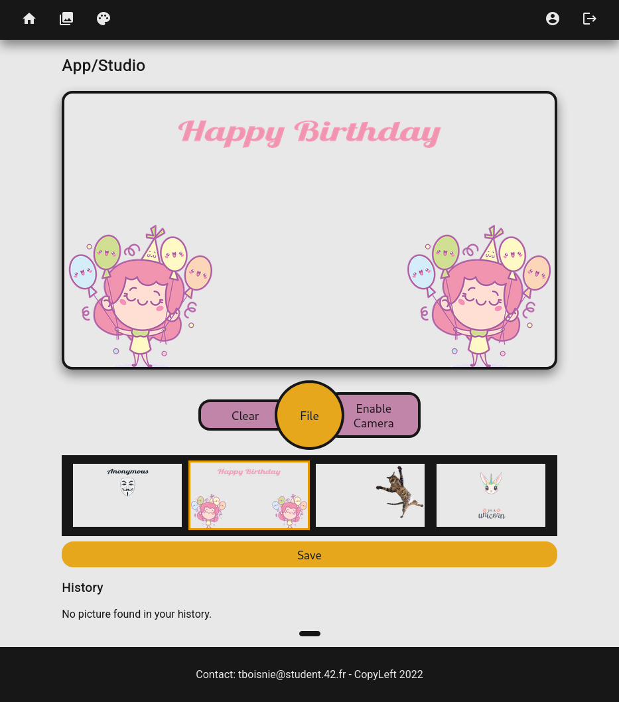
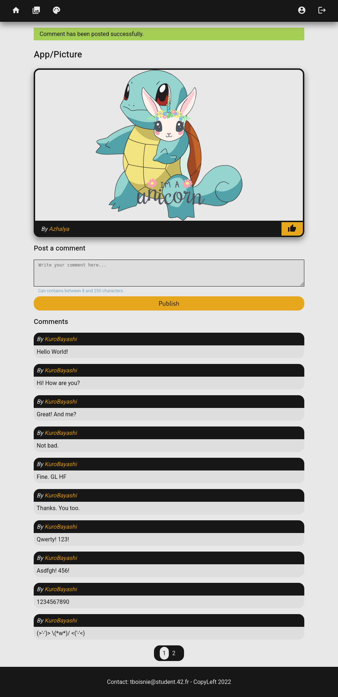

# 42 - Web - Camagru

Creation of a website using `HTML`, `CSS`, `PHP` and `SQL` _(no lib/framework allowed)_.

Features:
- User authentication (with email validation)
- Post pictures (using webcam or file) and apply a filter to them
- Add comments to pictures

## Requirements

- [Docker](https://www.docker.com/)

## Getting Started

1. Configure

	```sh
	# Change directory
	cd ./srcs

	# Environment
	cp camagru.env .env
	vim .env

	# Mail
	sed -i 's/YOUR_GMAIL_ADDRESS/something@gmail.com/g' ./docker/php/config/msmtprc
	```

1. Build

	```sh
	# Run
	./start.sh
	```

1. Access : __https://localhost:4443__

## Troubleshooting

- Find server IP _(if docker does not use localhost)_

	```sh
	docker inspect -f '{{range.NetworkSettings.Networks}}{{.Gateway}}{{end}}' srcs-server-1
	```

## Screenshots






## Author

- [BOISNIER Thomas](https://github.com/TBoisnie)
