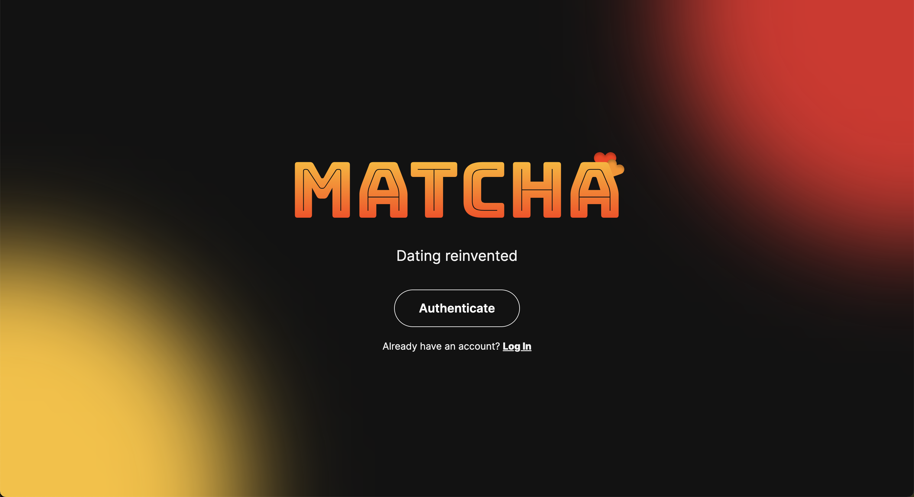
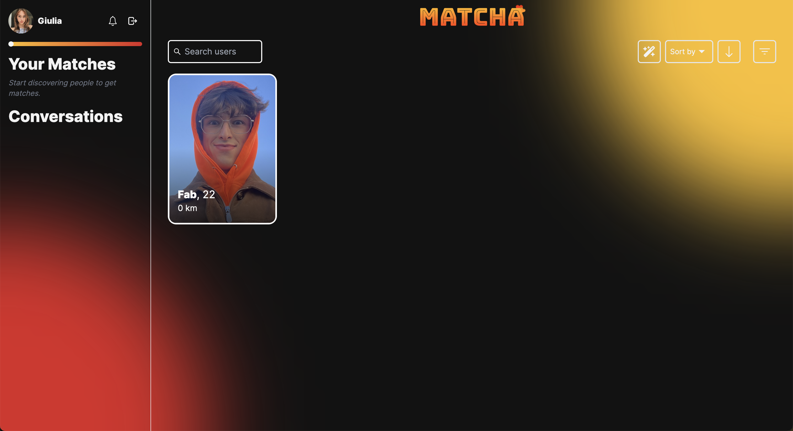
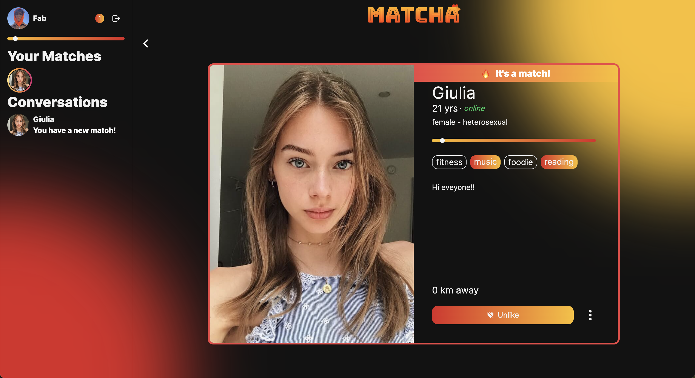
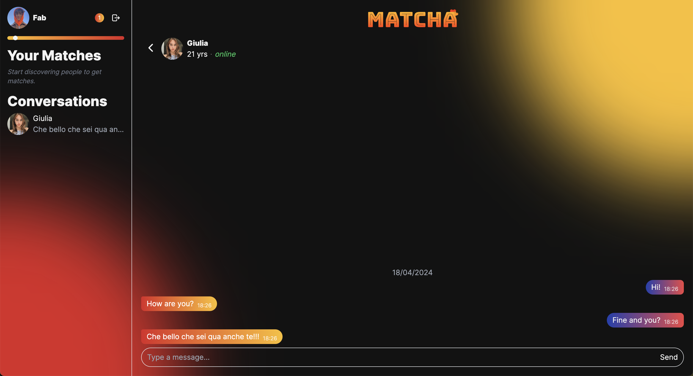
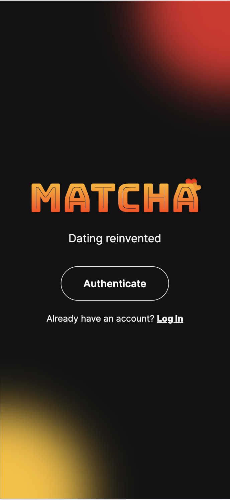
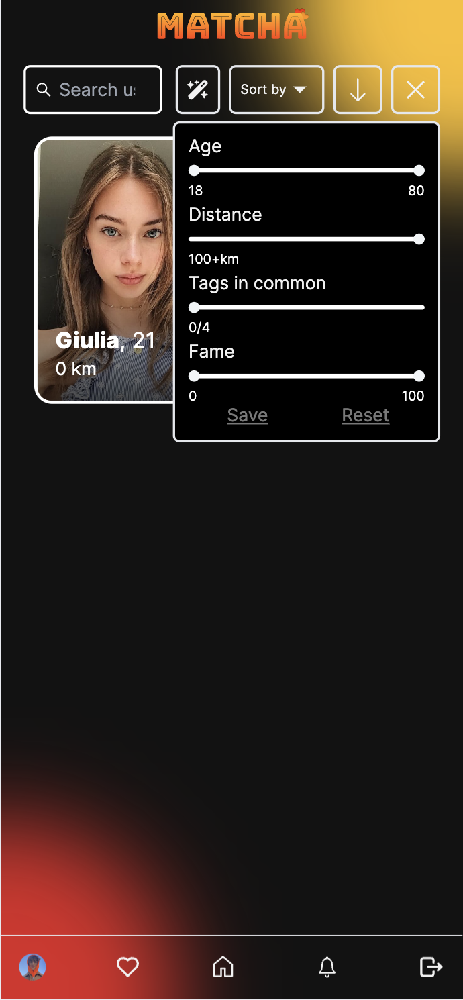
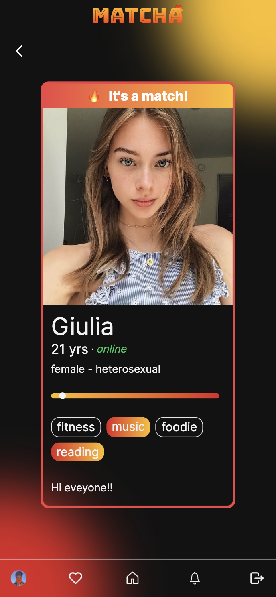
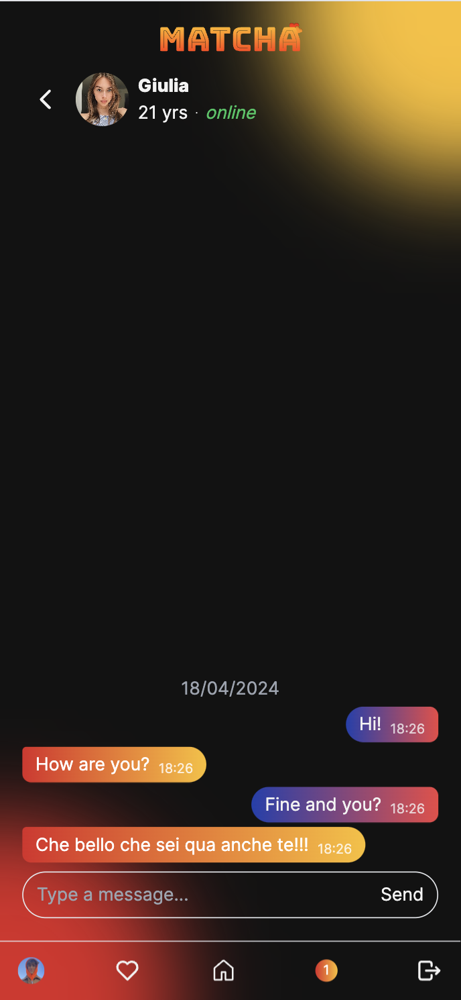

# 42 - Web - Matcha

Creation of a dating website using `TypeScript`, `React`, `Redux`, `Socket.io`, `TailwindCSS` `ExpressJS`, `PostgreSQL` and `Docker`.

Features :
- User authentication : Crendentials, Email verification, Lost password, ...
- User profile : Between 1 and 5 pictures, Location, Tags, Age, Gender, Sex preferences, ...
- User views : History of watched profiles
- User relations : Like, Block, Report
- User status : Online / Offline
- Fame score : Based on likes, activity, blocks/reports, ...
- Private chat : When 2 persons liked each other
- Notifications : On like, message, profile view, ...
- Search : By distance, common tags, ...
- ...

## Requirements

- [Docker](https://www.docker.com/)

## Getting Started

1. Configure

	```sh
	# Change directory
	cd ./dockers

	# Edit
	cp .env.template .env
	vim .env
	```

1. Build

	```sh
	# Run
	docker compose up
	```

1. Access : __https://localhost:4443__

## Screenshots

### Desktop

| Landing Page | Home |
| --- | --- |
|  |  |

| User Profile | Chat |
| --- | --- |
|  |  |

### Mobile

| Landing Page | Home |
| --- | --- |
|  |  |

| User Profile | Chat |
| --- | --- |
|  |  |

## Authors

- [BOISNIER Thomas](https://github.com/TBoisnie) _(Server / API)_
- [MANETTI Fabrizio](https://github.com/manettifabrizio) _(Client / UI)_
