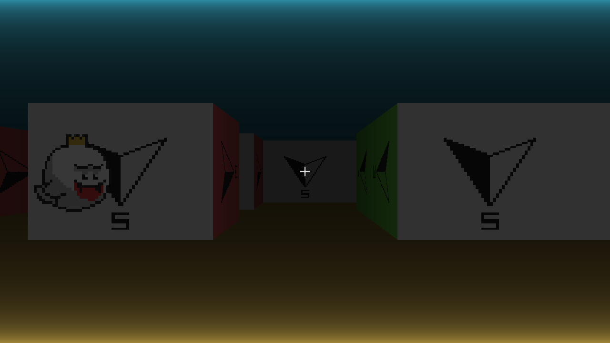

# 42 - Core - Cub3D

Implementation in `C` of a `ray casting` "engine" to render a customizable map in which one we can move around.


## Requirements

- [MLX](https://github.com/42Paris/minilibx-linux)
- [Make](https://www.gnu.org/software/make/)
- [GCC](https://gcc.gnu.org/)

## Getting Started

1. Compile

	```sh
	# Change directory
	cd ./srcs

	# Make
	make [ all | clean | fclean | re | bonus ]
		# all : Compile required files and build executable
		# clean : Delete object ".o" files
		# fclean : Delete object ".o" and executable "cud3D" files
		# Re : Run "fclean" then "all"
		# bonus : Same as "all"
	```

1. Execute

	```sh
	# Move executable
	mv ./cub3D ../tests/

	# Change directory
	cd ../tests

	# Run (Non interactive)
	./cub3D ./custom.cub --save
		# --save : Take a screenshot of the first image rendered and quit

	# Run (Interactive)
	./cub3D ./custom.cub
		# Commands:
		# W, A, S, D : Move
		# Arrow left/right : Turn the camera
		# Esc : Quit
	```

## Screenshots




## Author

- [BOISNIER Thomas](https://github.com/TBoisnie)
