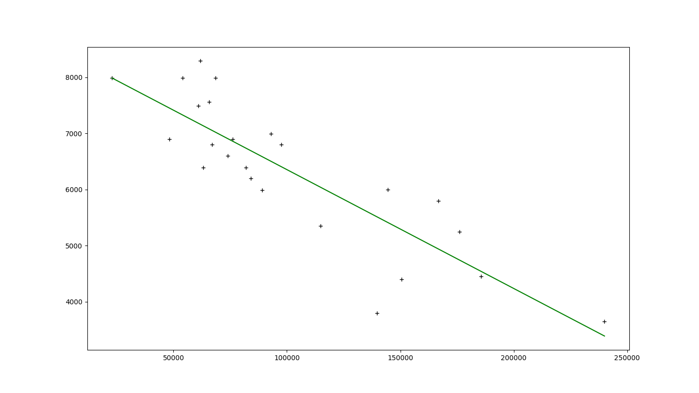

# 42 - AI - FT Linear Regression

Introduction in `python` to Machine Learning.

Two simple programs :
- Trainer : Load data from a CSV file, and estimate a Linear Regression (can render a GUI to display it).
- Estimater : Load data generated by the Trainer to estimate for a specified value.

## Requirements

- [Python 3](https://www.python.org/)

## Getting Started

1. Install dependencies

	```sh
	# Virtual Env + Dependencies
	./setup.sh
	```

1. Training

	```sh
	# Run
	.venv/bin/python ./srcs/trainer.py --input ./tests/data_0.csv
		# -v, --visual : Display GUI
		# -d, --duration : Display GUI for X seconds
		# -i, --input : Input data
		# -o, --output : Output data (default: .infos.csv)
		# -alt, --alt-algorithm : Use least square error
	```

1. Estimate

	```sh
	# Run
	.venv/bin/python ./srcs/estimer.py
		# -i, --input : Input data (default: .infos.csv)
	```

## Example

```sh
# Training
.venv/bin/python ./srcs/trainer.py --input ./tests/data_0.csv

[Warning][main] Training: Ignoring row 1: X (km) and Y (price) must be float.
Algorithm: Gradient Descent
Theta: [0.934471359967833, -0.9907805167880435]
Accuracy: 73.285481%

# Estimate
.venv/bin/python ./srcs/estimater.py

Mileage: 145850
Estimation: 5382.398565181974
Accuracy: 73.285481%
```

## Screenshots



## Author

- [BOISNIER Thomas](https://github.com/TBoisnie)
