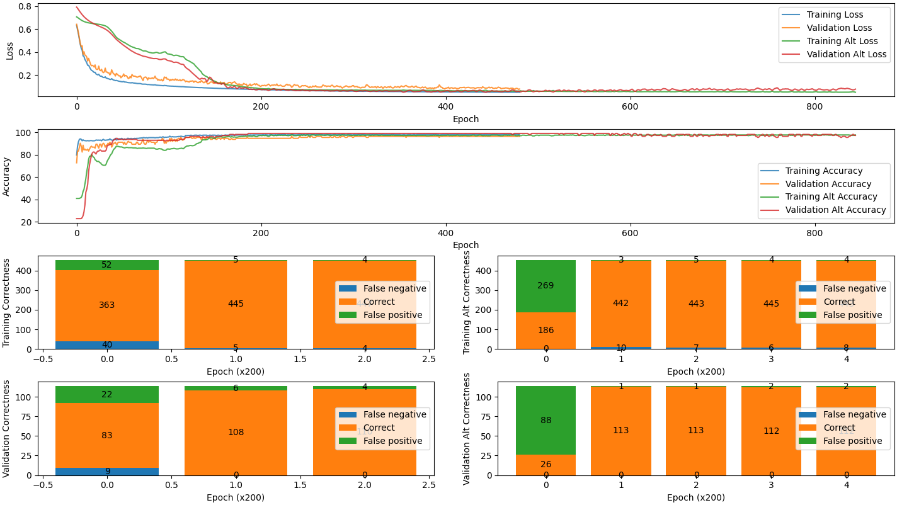

# 42 - AI - Multi-Layer Perceptron

This project is about building a multi-layer perceptron to analyse a dataset
describing the characteristics of a cell nucleus of breast mass extracted with
fine-needle aspiration, and therefore being able to predict if it is Malignant
or Benign.

## Requirements

- [Python 3](https://www.python.org/)

## Getting Started

1. Setup

	```sh
	> ./setup.sh
	Setting up the virtual environment...
	Installing the dependencies...
	```

1. Run

	```sh
	# Describe dataset
	.venv/bin/python3 ./srcs/main.py --action describe

	# Split dataset
	.venv/bin/python3 ./srcs/main.py --action split [--percent 50]

	# Train model
	.venv/bin/python3 ./srcs/main.py --action train [--data ./assets/data.train.csv] [--model ./assets/model.json] [--seed 42]

	# Predict using previously trained model
	.venv/bin/python3 ./srcs/main.py --action predict [--data ./assets/data.valid.csv] [--model ./assets/model.json]

	# Split + Train + Predict
	.venv/bin/python3 ./srcs/main.py [--action all] [--data ./assets/data.valid.csv] [--model ./assets/model.json] [--percent 50] [--seed 42]

	# Compare 2 internal models
	.venv/bin/python3 ./srcs/main.py --action compare [--data ./assets/data.valid.csv] [--percent 50] [--seed 42]
	```

## Example

```sh
.venv/bin/python3 ./srcs/main.py

(Train) Epoch     0: Loss 0.632698   Accuracy 79.7802  Correctness (C) 363 (FP)  52 (FN)  40
(Valid) Epoch     0: Loss 0.641615   Accuracy 72.807   Correctness (C)  83 (FP)  22 (FN)   9
(Train) Epoch     1: Loss 0.594941   Accuracy 87.6923  Correctness (C) 399 (FP)  36 (FN)  20
(Valid) Epoch     1: Loss 0.605238   Accuracy 83.3333  Correctness (C)  95 (FP)  18 (FN)   1
(Train) Epoch     2: Loss 0.55501    Accuracy 91.6484  Correctness (C) 417 (FP)  27 (FN)  11
(Valid) Epoch     2: Loss 0.565467   Accuracy 83.3333  Correctness (C)  95 (FP)  19 (FN)   0
(Train) Epoch     3: Loss 0.509931   Accuracy 93.8462  Correctness (C) 427 (FP)  20 (FN)   8
(Valid) Epoch     3: Loss 0.519276   Accuracy 86.8421  Correctness (C)  99 (FP)  15 (FN)   0
(Train) Epoch     4: Loss 0.464921   Accuracy 94.2857  Correctness (C) 429 (FP)  18 (FN)   8
(Valid) Epoch     4: Loss 0.473309   Accuracy 90.3509  Correctness (C) 103 (FP)  11 (FN)   0
(Train) Epoch     5: Loss 0.432843   Accuracy 93.8462  Correctness (C) 427 (FP)  19 (FN)   9
(Valid) Epoch     5: Loss 0.447544   Accuracy 87.7193  Correctness (C) 100 (FP)  14 (FN)   0
(Train) Epoch     6: Loss 0.416161   Accuracy 92.5275  Correctness (C) 421 (FP)  29 (FN)   5
(Valid) Epoch     6: Loss 0.45421    Accuracy 82.4561  Correctness (C)  94 (FP)  20 (FN)   0
(Train) Epoch     7: Loss 0.366959   Accuracy 93.4066  Correctness (C) 425 (FP)  20 (FN)  10
(Valid) Epoch     7: Loss 0.380655   Accuracy 88.5965  Correctness (C) 101 (FP)  13 (FN)   0
(Train) Epoch     8: Loss 0.360782   Accuracy 92.7473  Correctness (C) 422 (FP)  28 (FN)   5
(Valid) Epoch     8: Loss 0.402821   Accuracy 84.2105  Correctness (C)  96 (FP)  18 (FN)   0
(Train) Epoch     9: Loss 0.334814   Accuracy 92.7473  Correctness (C) 422 (FP)  25 (FN)   8
(Valid) Epoch     9: Loss 0.37282    Accuracy 85.0877  Correctness (C)  97 (FP)  17 (FN)   0
(Train) Epoch    10: Loss 0.321677   Accuracy 92.5275  Correctness (C) 421 (FP)  27 (FN)   7
(Valid) Epoch    10: Loss 0.368749   Accuracy 84.2105  Correctness (C)  96 (FP)  18 (FN)   0
(Train) Epoch    11: Loss 0.306356   Accuracy 92.5275  Correctness (C) 421 (FP)  27 (FN)   7
(Valid) Epoch    11: Loss 0.356104   Accuracy 84.2105  Correctness (C)  96 (FP)  18 (FN)   0
(Train) Epoch    12: Loss 0.283971   Accuracy 92.7473  Correctness (C) 422 (FP)  24 (FN)   9
(Valid) Epoch    12: Loss 0.32132    Accuracy 85.0877  Correctness (C)  97 (FP)  17 (FN)   0
(Train) Epoch    13: Loss 0.284903   Accuracy 92.5275  Correctness (C) 421 (FP)  27 (FN)   7
(Valid) Epoch    13: Loss 0.344872   Accuracy 83.3333  Correctness (C)  95 (FP)  19 (FN)   0
(Train) Epoch    14: Loss 0.268633   Accuracy 92.5275  Correctness (C) 421 (FP)  26 (FN)   8
(Valid) Epoch    14: Loss 0.321482   Accuracy 85.0877  Correctness (C)  97 (FP)  17 (FN)   0
(Train) Epoch    15: Loss 0.252954   Accuracy 92.7473  Correctness (C) 422 (FP)  24 (FN)   9
(Valid) Epoch    15: Loss 0.296226   Accuracy 86.8421  Correctness (C)  99 (FP)  15 (FN)   0
(Train) Epoch    16: Loss 0.241389   Accuracy 92.7473  Correctness (C) 422 (FP)  23 (FN)  10
(Valid) Epoch    16: Loss 0.279896   Accuracy 87.7193  Correctness (C) 100 (FP)  14 (FN)   0
...
```

## Screenshots




## Resources

- https://www.youtube.com/watch?v=XJ7HLz9VYz0&list=PLRqwX-V7Uu6Y7MdSCaIfsxc561QI0U0Tb&index=1
- https://medium.com/towards-data-science/understanding-binary-cross-entropy-log-loss-a-visual-explanation-a3ac6025181a
- https://www.v7labs.com/blog/cross-entropy-loss-guide#binary-cross-entropy-loss

## Author

- [BOISNIER Thomas](https://github.com/TBoisnie)
